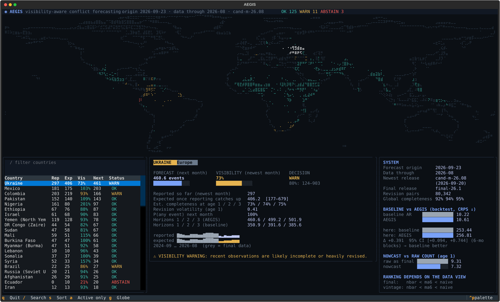

# AEGIS

**Visibility-aware probabilistic forecasting under delayed and selective observation.**

Conflict event data arrives late and gets revised. A month that looks quiet in the
newest release may only look quiet because reports haven't arrived yet. Most forecasting
systems treat the latest data as the truth. AEGIS doesn't. It estimates how complete the
recent record probably is, forecasts with that in mind, and evaluates itself only on the
data that existed at the time of each forecast.

> A quiet feed is not the same as a quiet world.

`aegis` opens a terminal interface built for that distinction:

- a braille world map of the last three months of reported events, coloured by how well
  AEGIS can see each country;
- for the selected country: what was reported, what the count is expected to become once
  reporting catches up, the forecast, and a visibility decision (`OK`, `WARN` or `ABSTAIN`);
- a panel that always puts the simple baseline's backtest score next to AEGIS's.



## Status: v0.1 (research core)

| Layer | v0.1 |
|---|---|
| 1. Data | UCDP Candidate (68 monthly + 22 cumulative releases, 2021-01 → 2026-08) and UCDP GED finals 22.1–26.1 |
| 2. Vintage store | Immutable raw files with SHA-256; parquet copies; availability date per release |
| 3. Observation model | Estimated completeness per country and vintage age, learned from past revision pairs |
| 4. Nowcast | Negative-binomial nowcast of each recent month's eventual count |
| 5. Forecast | `naive`, `ma6`, `nbar` (level-anchored NB autoregression) and `nbar+vis` (AEGIS) |
| 6. Calibration | CRPS, log score, Brier, 80% coverage, PIT, origin-block bootstrap |
| 7. Research monitor | `aegis backtest` report; baseline vs AEGIS in the interface |
| 8. Interface | Terminal UI (`aegis`); 3D globe deferred until the results hold up |

ACLED is deliberately not in v0.1. Its licence forbids redistributing raw data and needs
each user's own key. It comes next, for the reporting-delay model (event date vs
publication timestamp).

## Install

Requires Python 3.11+ and [uv](https://docs.astral.sh/uv/) (or pip).

```bash
uv venv --python 3.12 .venv
```

```bash
uv pip install --python .venv/Scripts/python.exe -e ".[dev]"
```

On macOS/Linux use `.venv/bin/python`.

## Use

```bash
aegis sync
```

This downloads every UCDP release once (about 450 MB), records hashes and availability
dates, and computes today's forecast. After that, run:

```bash
aegis
```

| Key | Action |
|---|---|
| ↑ ↓ | select a country |
| `/` | filter by name (Enter returns to the list) |
| `s` | sort by forecast, visibility or status |
| `a` | active countries only / all |
| `q` | quit |

Other commands:

| Command | What it does |
|---|---|
| `aegis forecast [--asof YYYY-MM-DD]` | forecast cycle for today, or for a past date using only what was known then |
| `aegis backtest [--start --end --target events\|deaths]` | vintage-aware walk-forward evaluation |
| `aegis explain <country>` | the evidence: how each recent month's count changed across releases |
| `aegis status` | contents of the vintage store, and any releases with caveats |
| `aegis verify` | re-hash every raw download against the manifest |

## How it works

### Vintages

`snapshot(asof)` rebuilds the event list exactly as it could have been known on a given
date:

1. The newest *final* GED release available is authoritative for the months it covers.
2. For later months, the newest *cumulative* Candidate release covering the month replaces
   the monthly releases before it. Events can be removed as well as added.
3. Monthly releases published after that add late events.
4. Nothing published after `asof` is read. `tests/test_vintage.py` enforces this.

A release counts as available from its HTTP `Last-Modified` date. That date is an upper
bound on first publication, so it can only make AEGIS more conservative. If a file was
re-uploaded long after release, a rule-based date is used instead and flagged in
`aegis status`.

### Observation model

For country *c* and vintage age *a* (1 = the newest month, as first released):

    C(c, a) = E[count reported by age a] / E[eventual final count]

This is **estimated observation completeness**, not "the share of reality we can see".
Unobserved events cannot be counted directly.

C is learned from past pairs of (count at age *a*, final count). Only final values that
had been published by the forecast origin are used. Country estimates are shrunk toward
the age average, and older behaviour is down-weighted (18-month half-life). C can exceed
1: Candidate data sometimes includes events that later vetting removes.

Nowcast of the eventual count:

- `observed / C` if anything was reported;
- a learned zero-report rate otherwise;
- in both cases negative-binomial, with dispersion fitted per age.

### Forecasts

`nbar` is a pooled negative-binomial regression anchored to the six-month level:

    log μ = log(ma6 + 0.1) + β · [momentum, acceleration, small-count terms]

The first version, which was not anchored, forecast about 9,900 events for Ukraine when 710
happened. The anchor makes large counts scale proportionally.

`nbar+vis` (AEGIS) fits the same model on nowcast-corrected history. Its forecast is a
mixture over nowcast draws, so uncertainty about the recent past carries into the future.

### Visibility decision

This is a consequence of an impaired observation process, never of model confidence:

- `ABSTAIN`: C(c, 1) < 0.5, **or** a silent channel (active in the last 12 months, nothing
  reported in the newest release) where silence has historically hidden events.
- `WARN`: C(c, 1) < 0.8, high revision volatility, or a silent channel.
- `OK`: otherwise.

### Evaluation

Forecast origins are the dates on which each monthly Candidate release appeared.

- Every model is fitted on the vintage available at that date.
- Every model is scored against the newest final release.
- The same models are also run on the final data ("final view"). This is the usual, leaky
  retrospective setup; Paper 1 compares the two views.
- Differences between models are paired, with 95% intervals from a bootstrap over whole
  origins.

## Results

See [RESULTS.md](RESULTS.md) for the current backtest and what it does and does not show.

## Known limitations

- **UCDP only.** Counts are UCDP events of organised violence (at least one death),
  aggregated to country-month. Sub-national cells come later.
- **Five 2022 releases (22.06–22.09 and the H1 cumulative file) were re-uploaded on
  20 December 2022.** AEGIS dates them by the release rule. If the re-upload changed
  their content, a few months of 2022 origins may see slightly revised data.
- **Candidate 24.0.1 was published without a header row.** Standard GED columns are
  assumed; the release is flagged.
- **Truth is `final-26.1`, covering data through December 2025.** Origins after November
  2025 cannot be scored yet.
- **CRPS on raw counts is dominated by a few high-volume countries** (Ukraine, Mexico,
  Israel). Log score and the per-country panels balance this.
- **The observation model is deliberately simple:** a ratio estimator with shrinkage, not
  the full hazard or delay model. It is a baseline for the delay models to beat.

## Scope

Aggregate, public-data, country-month forecasting for research. The following are out of
scope by design:
- individual people or named individuals;
- scanning, or any collection beyond published datasets;
- targeting;
- predictive policing.

## Data and licence

- Code: MIT.
- UCDP data: [CC BY 4.0](https://ucdp.uu.se/downloads/). Cite Sundberg & Melander (2013) for
  GED and Hegre et al. (2020) for the Candidate dataset.
- Map outline: Natural Earth (public domain).
- No data is committed to this repository. `aegis sync` fetches it from the source.

Research background, prior-art review and the corrections log: [RESEARCH.md](RESEARCH.md).
